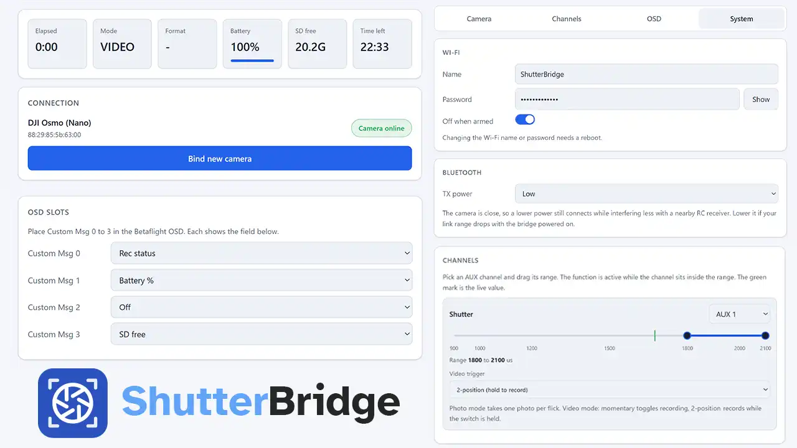

<div align="center">


# ShutterBridge

**Your camera, on the OSD. Your switches, on the shutter.**

ESP32 firmware that links your flight controller and action camera - camera
status drawn straight on your goggles, and RC switches mapped to record, photo
and mode.

[](LICENSE)
[](https://www.waveshare.com/esp32-s3-zero.htm)
[](https://betaflight.com)
[](https://platformio.org)

[**⚡ Flash it now**](https://shutterbridge.yarosfpv.com/flash) &nbsp;·&nbsp;
[**📖 Documentation**](https://shutterbridge.yarosfpv.com/docs) &nbsp;·&nbsp;
[**🌐 Website**](https://shutterbridge.yarosfpv.com)

</div>

---

## What it does

ShutterBridge runs on a small ESP32-S3 board wired to your flight controller. It
talks to your action camera over Bluetooth LE and to Betaflight over MSP, so you
get two things in flight:

- **Camera status on your OSD** - record state, battery, SD space, mode,
  resolution/FPS and recording timers, drawn right where you're looking.
- **RC switches on the shutter** - start recording when you arm, stop when you
  disarm, trigger photos, or switch modes from a channel. No touching the camera.

Everything is configured from a clean on-device Web UI - connect to the board's
Wi-Fi access point and open it in a browser. No app, no drivers.

## See it in action

<table>
  <tr>
    <td align="center" width="33%">
      
      <br /><sub><b>Arm to record</b></sub>
    </td>
    <td align="center" width="33%">
      
      <br /><sub><b>OSD in the goggles</b></sub>
    </td>
    <td align="center" width="33%">
      <picture>
        <source media="(prefers-color-scheme: dark)" srcset="site/public/gallery/ui-dark.webp" />
        
      </picture>
      <br /><sub><b>Web UI</b></sub>
    </td>
  </tr>
</table>

## Compatible cameras

The Osmo Action series and the Osmo 360 share the same DJI R-SDK backend.

| Feature                                           | DJI Osmo (Nano) | DJI Action / 360 | GoPro (HERO9+) |
| ------------------------------------------------- | :-------------: | :--------------: | :------------: |
| Connect + auto-reconnect                          |       ✅        |        ✅        |       ✅       |
| Pairing (accept PIN / bond on the camera)         |  not required   |     ✅ (PIN)     |   ✅ (bond)    |
| OSD telemetry (record state, battery, SD, timers) |       ✅        |        ✅        |       ✅       |
| Mode readout (video / photo)                      |       ✅        |        ✅        |       ❌       |
| Photo / video mode switch                         |       ❌        |        ✅        |       ✅       |
| Resolution / FPS readout                          |       ❌        |        ✅        |       ✅       |
| Start / stop recording (with optional delay)      |       ✅        |        ✅        |       ✅       |
| Take photo                                        |      ✅\*       |        ✅        |       ✅       |
| Preset switching (Video / Photo / Timelapse)      |       ❌        |        ❌        |       ✅       |
| Load preset by ID                                 |       ❌        |        ❌        |       ✅       |
| Clock sync from FC GPS time                       |       ❌        |        ❌        |       ✅       |
| Tested on real hardware                           |       ✅        |  ✅ (Action 4)   |       ❌       |

_\* The Osmo Nano can't switch photo/video over BLE, so the shutter captures a photo only when the camera is already set to Photo mode. The Action / 360 / GoPro switch modes automatically or via the Camera Mode switch._

> [!WARNING]
> **Wake the Osmo Nano before recording.** Starting a recording while the camera is asleep (standby / screen off) produces a corrupted, very-low-FPS clip. Wake it and wait until it reads online before you arm - a current limitation with no known fix.

## What you need

- **Waveshare ESP32-S3-Zero** (ESP32-S3FH4R2 - 4 MB flash, 2 MB PSRAM, native USB) - the board ShutterBridge is built for.
- **Betaflight 2025.12 or newer** on your flight controller - talks to the bridge over MSP and draws the OSD elements.
- **A supported action camera** - a DJI Osmo / Action or a GoPro HERO9 or newer.

## Getting started

The easiest path is the browser-based flasher - no toolchain required:

1. Plug the board into a data-capable USB-C port.
2. Open the [**web flasher**](https://shutterbridge.yarosfpv.com/flash) in Chrome or Edge and click **Install**.
3. Pick the board's serial port when prompted and wait for it to finish.
4. Re-plug the board, connect to the `ShutterBridge` Wi-Fi access point (password `shutterbridge`), and open `http://10.0.0.1` to finish setup.

See the [full documentation](https://shutterbridge.yarosfpv.com/docs) for wiring, Betaflight OSD setup and per-camera notes.

## Building from source

The firmware is a [PlatformIO](https://platformio.org) project. From the `firmware/` folder:

```bash
# Build and flash the firmware over USB
pio run -t upload

# Build and upload the Web UI (LittleFS) image
pio run -t uploadfs
```

`pack-localhost-dev-firmware.sh` bundles the build output into the site's local
web flasher for development.

Planning to contribute? See [CONTRIBUTING.md](CONTRIBUTING.md) for the dev setup,
and how to submit changes.

## Repository layout

| Path        | What's inside                                                     |
| ----------- | ----------------------------------------------------------------- |
| `firmware/` | ESP32-S3 firmware (PlatformIO) and the on-device Web UI.          |
| `site/`     | The website, documentation and browser-based web flasher (Astro). |

## License

ShutterBridge is free software, licensed under the **GNU General Public License
v3.0 or later**. See [`LICENSE`](LICENSE) for the full text.

Copyright © 2026 YarosFPV
